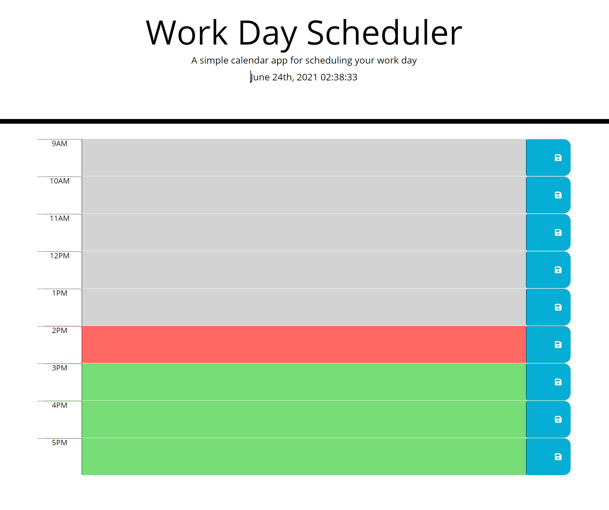

# day-planner
Web app that tracks and updates the time, allows users to input events for the day
https://maxd66.github.io/day-planner/

## Description

This web app tracks the date and time and actively updates a work scheduler from 9am - 5pm. Time slots are color coded based on the time of day. You can also input day plans and save them to specific time slots. They will persist in the local storage on the browser.

## Installation and Usage

There is no installation required. If you would like to clear a task from the calendar, just clear it and save the empty slot.

## Credits

The html and css were provided to me by UCSD Extension Coding Bootcamp. I, however, constructed the javascript and did make some changes to the CSS.

## License

The website was insired by a mockup provided by UCSD Coding Bootcamp Extension.

